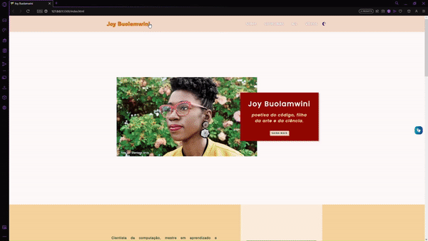
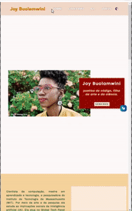

# Página sobre Joy Buolamwini 

Projeto Final do Curso de Programação Web para Iniciantes da WoMakersCode em parceria com a Potência Tech e iFood. O site é sobre uma mulher importante para a tecnologia.  
Design responsivo e interativo, por meio do uso de algumas funcionalidades com JavaScript. https://nataliavolpi.github.io/page-about-joy-buolamwini/

## Demonstração:

## Recursos utilizados:
**<image src="https://img.shields.io/badge/HTML5-E34F26?style=for-the-badge&logo=html5&logoColor=white" alt="logo-HTML">** 
**<image src="https://img.shields.io/badge/CSS3-1572B6?style=for-the-badge&logo=css3&logoColor=white" alt="logo-CSS">** 
**<image src="https://img.shields.io/badge/JavaScript-F7DF1E?style=for-the-badge&logo=javascript&logoColor=black" alt="logo-JS">** 

-------------------------------------------------------------------------------------------------
## Web page about Joy Buolamwini 

Final Project of the WoMakersCode Web Programming Course for Beginners in partnership with Potência Tech and iFood. The site is about an important woman in technology.  
Responsive and interactive design, through the use of some JavaScript functionality.
